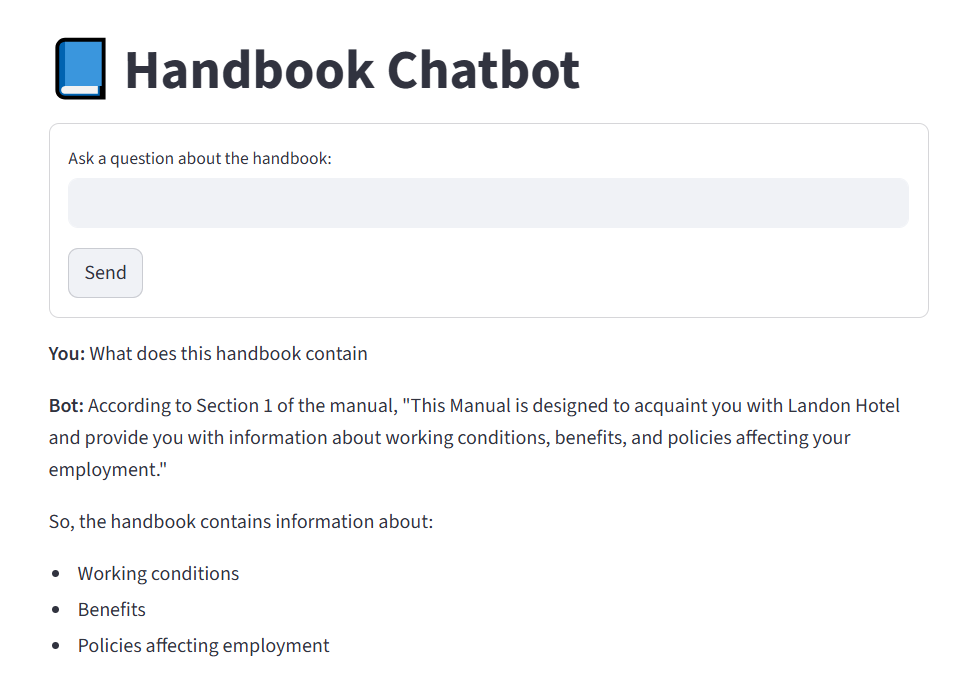

# 💬 RAG Chatbot with LangChain, FAISS & Ollama (Streamlit UI)

This project demonstrates a Retrieval-Augmented Generation (RAG) chatbot using LangChain, FAISS for vector storage, and a local LLM served via Ollama. It allows users to query knowledge from custom documents with a simple Streamlit web interface.

## ✨ Features
- Document-based Question Answering
- Local LLM with Ollama (no external API costs)
- LangChain + FAISS for embedding & retrieval
- Simple Streamlit frontend for user interaction

⚡ Installation & Setup

1. Clone this repository
git clone https://github.com/NazarAbbas234/rag_langchain_streamlit.git
cd rag_langchain_streamlit

2. Create & activate a virtual environment (recommended)
python -m venv venv
venv\Scripts\activate   # On Windows
source venv/bin/activate  # On Mac/Linux

3. Install dependencies
pip install -r requirements.txt

4. Install & run Ollama (for local LLM)
4.1 Download Ollama: https://ollama.ai
4.2 Pull a model (example: Llama3):
    ollama pull llama3
4.3 Run Ollama in a separate terminal:
    ollama run llama3

5. Start the Streamlit app
streamlit run app.py

🎯 Usage

Place your document(s) inside the data/ folder (e.g., handbook.docx)
Start the Streamlit app
Ask questions in the chatbox — the model will answer using your document context

💡 Example

Q: What topics are covered in the handbook?
A: The handbook covers company policies, leave structure, and employee benefits.

## 🔧 Tech Stack

Python 3.10+
LangChain
FAISS
Ollama (local LLM)
Streamlit

## 💻 Demo

Here’s how the chatbot looks in action:

